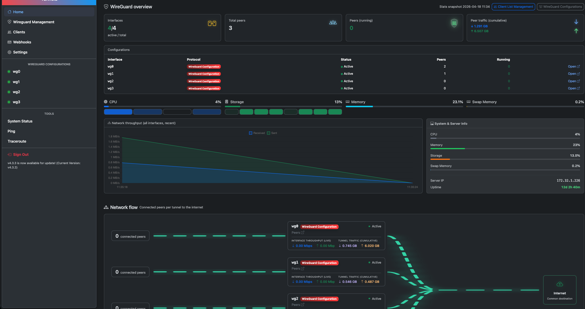
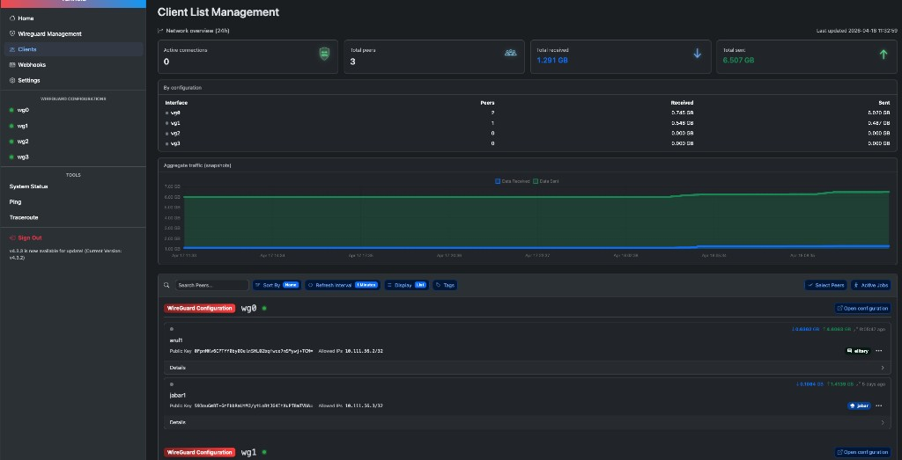
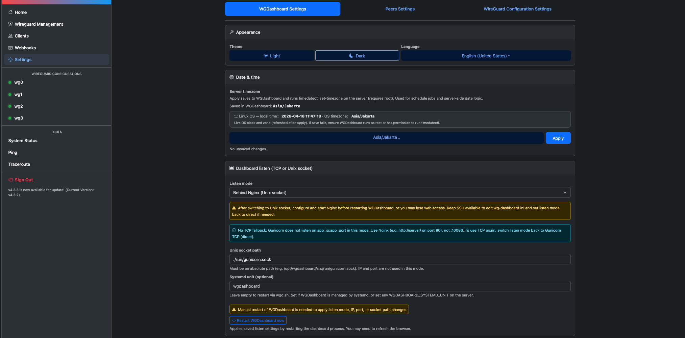
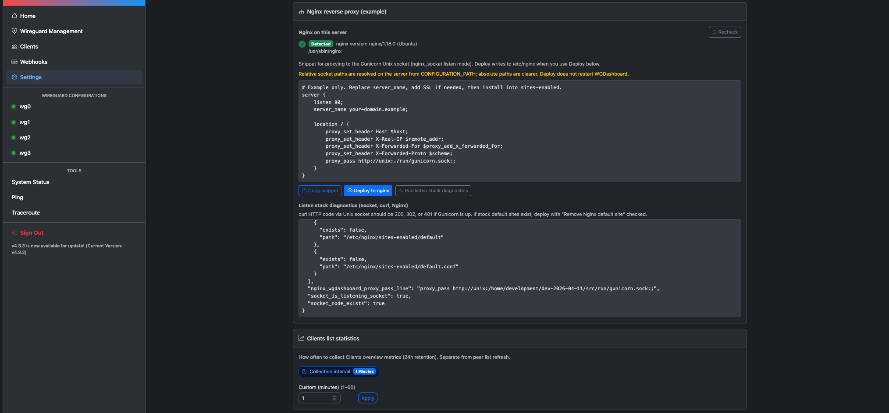

# Tunnela

A production-oriented [WGDashboard](https://github.com/WGDashboard/WGDashboard) fork with deployment-focused additions (Nginx + Gunicorn Unix socket, extended docs, and UI tweaks). It provides a **web UI** to manage **WireGuard** interfaces, peers, QR configs, and related operations.

Indonesian step-by-step guides live under [`src/install-step-by-step.md`](src/install-step-by-step.md) and related `implementasi-*.md` files.

---

## Screenshots

### Dashboard

**Home — WireGuard overview** — interface/peer summary, cumulative traffic, **system status** (CPU, memory, storage, swap), **network throughput** chart (all interfaces), server info, and **network flow** (peers → tunnels → Internet).



**Clients — list management** — 24h network overview, per-configuration traffic table, aggregate traffic snapshot, and searchable peer list with per-peer stats.



### Settings

**Date & time, listen mode & systemd** — server timezone, **Gunicorn** listen mode (direct TCP vs **Unix socket** for Nginx), socket path, and optional **systemd** unit name for in-app restarts.



**Nginx reverse proxy & Clients statistics** — deploy snippet / reverse-proxy card for **Nginx**, and **Clients** network overview / statistics configuration.



---

## Architecture

```
Browser  →  [ Nginx ]  →  Gunicorn (TCP or Unix socket)  →  Flask (dashboard.py)
                ↓                                              ↓
           TLS / HTTP                                   SQLAlchemy → SQLite | PostgreSQL | MySQL
                                                               ↓
                                                         wg / wg-quick (host)
```

| Layer | Responsibility |
|-------|------------------|
| **Reverse proxy** (optional) | TLS termination, HTTP(S) to users; `proxy_pass` to Gunicorn when using Unix socket mode. |
| **Gunicorn** | WSGI server; binds `app_ip:app_port` (direct) or Unix socket (`nginx_socket`). |
| **Flask app** (`dashboard.py`) | HTTP API, sessions, orchestration; loads `modules/*` services. |
| **Domain modules** | WireGuard / AmneziaWG config, peers, clients, jobs, OIDC, plugins — business logic. |
| **Persistence** | SQLAlchemy engines per logical DB name (`wgdashboard`, `wgdashboard_job`, `wgdashboard_log` for PostgreSQL). |
| **Host OS** | WireGuard tools, `/etc/wireguard`, optional systemd unit for restarts from UI. |

---

## Project structure

```
tunnela/
├── README.md
├── SUMMARY.md
├── templates/
│   └── wg-dashboard.ini.template    # Reference INI (no secrets)
└── src/
    ├── dashboard.py                 # Flask app entry
    ├── gunicorn.conf.py
    ├── wgd.sh                       # install | start | stop | restart | debug
    ├── requirements.txt
    ├── modules/                     # Core Python packages (config, WG, clients, …)
    ├── static/
    │   ├── app/                     # Vue admin UI (source)
    │   └── dist/                    # Built admin/client assets (prebuilt in repo)
    ├── locales/
    ├── install-step-by-step.md
    ├── implementasi-nginx-gunicorn-socket.md
    ├── sudoers.wgdashboard.example
    └── wg-dashboard.service         # Example systemd unit
```

Runtime paths (created locally, not committed): `venv/`, `db/`, `log/`, `wg-dashboard.ini`, `run/` (socket parent), etc. See [`.gitignore`](.gitignore).

---

## Quick start

### Prerequisites

| Requirement | Notes |
|-------------|--------|
| **Linux** | Debian/Ubuntu, RHEL family, Alpine (experimental), Arch — as supported by `wgd.sh`. |
| **Python** | **3.10, 3.11, or 3.12** (enforced by installer). |
| **sudo** | Used for package install, `/etc/wireguard`, and Gunicorn lifecycle in default setup. |
| **Network** | Outbound HTTPS for PyPI during `./wgd.sh install`. |
| **WireGuard** | Installed by the script if missing (`wg`, `wg-quick`). |

Optional: **PostgreSQL** or **MySQL** for production (see [Database](#database-postgresql)); **Node.js** only if you rebuild the Vue admin (`static/app`).

### 1. Clone

```bash
git clone https://github.com/arulriyadi/tunnela.git
cd tunnela
```

SSH:

```bash
git clone git@github.com:arulriyadi/tunnela.git
cd tunnela
```

### 2. Install (from `src/`)

```bash
cd src
chmod +x wgd.sh
./wgd.sh install
```

Logs: `src/log/install.txt`.

### 3. Run

```bash
./wgd.sh start
```

Default UI URL: `http://<host>:10086` (adjust `app_port` in `wg-dashboard.ini` → `[Server]`).

### 4. First login

Change the default admin password after first sign-in. Use [`templates/wg-dashboard.ini.template`](templates/wg-dashboard.ini.template) as a reference; local `wg-dashboard.ini` is gitignored.

---

## `wgd.sh` commands

| Command | Description |
|---------|-------------|
| `./wgd.sh install` | Create venv, install `requirements.txt`, WireGuard tools, initial folders. |
| `./wgd.sh start` | Start Gunicorn in background. |
| `./wgd.sh stop` | Stop Gunicorn. |
| `./wgd.sh restart` | Stop then start. |
| `./wgd.sh debug` | Run Flask app in foreground (development). |
| `./wgd.sh update` | Update flow (upstream WGDashboard style; review before use on a fork). |

---

## Environment variables

| Variable | Default | Description |
|----------|---------|-------------|
| `CONFIGURATION_PATH` | *(unset → `.`)* | Base path for `wg-dashboard.ini`, `db/`, `run/`, Lets Encrypt paths used by scripts. |
| `WGDASHBOARD_SYSTEMD_UNIT` | *(optional)* | Overrides `[Server] systemd_unit` for “restart service” from UI. |
| `ENVIRONMENT` | `develop` | Used by `wgd.sh` (e.g. certbot paths behavior). |

---

## Configuration files

| File | Purpose |
|------|---------|
| `src/wg-dashboard.ini` | Main app config (`[Server]`, `[Database]`, `[Account]`, …). Created/merged on first start. |
| `src/ssl-tls.ini` | TLS cert paths (optional). Copy from `ssl-tls.ini.example`. |
| `src/certbot.ini` | Certbot settings (optional). Copy from `certbot.ini.example`. |

Secrets must **not** be committed; use templates and `.example` files.

---

## Database (PostgreSQL)

If `[Database] type = postgresql`, the app expects **three** logical databases (auto-created if the DB role has `CREATEDB`, or create them manually):

| Database | Role |
|----------|------|
| `wgdashboard` | Primary app data |
| `wgdashboard_job` | Peer jobs |
| `wgdashboard_log` | Dashboard logging |

Grant `CREATEDB` to the application role, or pre-create all three and assign ownership. See discussion in project docs if you see `permission denied to create database`.

---

## API surface (overview)

The Flask app mounts routes under a configurable **`app_prefix`** (often empty). Typical patterns:

| Area | Pattern | Auth |
|------|---------|------|
| UI + JSON API | `GET/POST {APP_PREFIX}/api/...` | Session / API key / OIDC per route |
| Static admin | `GET {APP_PREFIX}/...` | Served after login as configured |

For a full list, inspect `dashboard.py` and route decorators. There is no separate OpenAPI file in-tree.

---

## Nginx & Unix socket

To put Tunnela behind Nginx with a Unix socket, set in `wg-dashboard.ini`:

- `app_listen_mode = nginx_socket`
- `gunicorn_socket_path` = absolute path to the `.sock` file

See **[src/implementasi-nginx-gunicorn-socket.md](src/implementasi-nginx-gunicorn-socket.md)** and **[src/sudoers.wgdashboard.example](src/sudoers.wgdashboard.example)** for deploy and passwordless `sudo` when the process is not root.

---

## Rebuild admin UI (optional)

```bash
cd src/static/app
npm ci   # or npm install
npm run build
```

Committed `src/static/dist` allows running without Node for production reads.

---

## Design decisions

| Decision | Rationale |
|----------|-----------|
| **Monolithic Flask app** | Matches upstream WGDashboard; single process model with clear `modules/` boundaries. |
| **INI + env for config** | No mandatory `.env` in repo; `wg-dashboard.ini` is the source of truth for operators. |
| **Multiple SQL databases (names)** | Jobs and logs separated from core schema; SQLite uses files under `db/`. |
| **Prebuilt `static/dist`** | Faster deployment on servers without frontend toolchain. |
| **Fork-specific docs in `src/`** | Operational runbooks (Nginx, install) stay next to the code. |

---

## Troubleshooting

| Symptom | Check |
|---------|--------|
| Install fails | `src/log/install.txt`, Python version, sudo, connectivity to PyPI. |
| PostgreSQL `CREATE DATABASE` denied | Role needs `CREATEDB` or pre-create `wgdashboard`, `wgdashboard_job`, `wgdashboard_log`. |
| Cannot open in browser | Firewall, `app_ip` / `app_port`, Gunicorn actually listening. |
| Nginx deploy from UI fails | Process user, `sudoers` entries, paths in `sudoers.wgdashboard.example`. |

---

## License

Follows upstream **WGDashboard** licensing (see source headers; **Apache-2.0** per upstream).

---

## Links

| Doc | Description |
|-----|-------------|
| [install-step-by-step.md](src/install-step-by-step.md) | Checklist, flow, INI sections (Indonesian). |
| [implementasi-nginx-gunicorn-socket.md](src/implementasi-nginx-gunicorn-socket.md) | Nginx + socket deployment. |
| [WGDashboard-version-check-flow.txt](docs/WGDashboard-version-check-flow.txt) | GitHub release check + `update_github_repo` / env (reference). |
| [Tunnela-fork-version-check-github.txt](docs/Tunnela-fork-version-check-github.txt) | Fork checklist for releases & GitHub. |
| [UPDATE-v4.3.3.md](UPDATE-v4.3.3.md) | Release notes for v4.3.3 (features, files, build). |
| [UPDATE-v4.3.4.md](UPDATE-v4.3.4.md) | Release notes for v4.3.4 (System & Server Info, API, locales). |

**TL;DR:** `cd src` → `./wgd.sh install` → `./wgd.sh start` → open `http://host:10086` → secure credentials and database.
