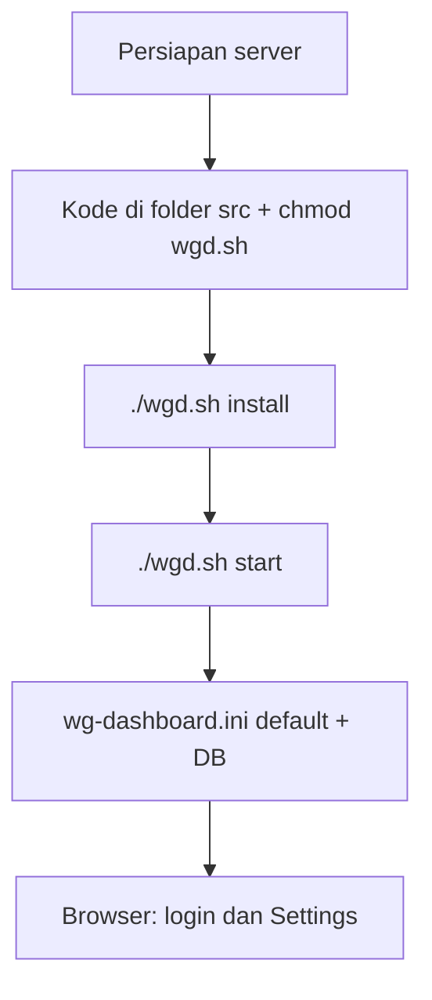

# Instalasi WGDashboard — langkah demi langkah

Dokumen ringkas: **apa yang disiapkan**, **perintah yang dijalankan**, dan **isi `wg-dashboard.ini`** yang perlu Anda pahami. Detail Nginx + Unix socket ada di [`implementasi-nginx-gunicorn-socket.md`](implementasi-nginx-gunicorn-socket.md).

---

## Flow singkat

Alur end-to-end dari nol sampai dashboard dipakai:



- **Install** hanya menyiapkan venv, dependensi Python, WireGuard tools, folder `log`/`db`, `ssl-tls.ini`.  
- **`wg-dashboard.ini`** utamanya dilengkapi otomatis saat **pertama kali start** (bukan wajib edit manual sebelum install).

---

## Sebelum `./wgd.sh install` — checklist

Centang yang relevan:

| # | Yang disiapkan | Wajib? |
|---|----------------|--------|
| 1 | **OS didukung** (Debian/Ubuntu, RHEL family, Alpine eksperimental, Arch — sama seperti `wgd.sh`) | Ya |
| 2 | **Akses `sudo`** — untuk paket sistem, `chmod` `/etc/wireguard`, dan `wgd.sh` memanggil `sudo` saat start/stop Gunicorn | Ya |
| 3 | **Kode WGDashboard** sudah di mesin; Anda akan `cd` ke folder yang berisi **`wgd.sh`** dan **`dashboard.py`** | Ya |
| 4 | **`chmod +x wgd.sh`** | Ya |
| 5 | **Internet** ke PyPI (saat install bisa pilih mirror) | Ya |
| 6 | **Python 3.10 / 3.11 / 3.12** — boleh belum terpasang; script bisa menginstalnya, tapi lebih cepat jika sudah ada | Disarankan |
| 7 | **`CONFIGURATION_PATH`** — set hanya jika config + `db/` + `run/` ingin di luar folder `src` | Opsional |
| 8 | **PostgreSQL / MySQL** — siapkan service & user DB jika tidak pakai SQLite; **isi `[Database]` biasanya setelah** aplikasi pernah jalan | Opsional |
| 9 | **Node.js + npm** — hanya jika Anda **build ulang** UI (`static/app`); **bukan** syarat `./wgd.sh install` | Opsional |
| 10 | **Nginx** — tidak perlu sebelum install; pasang nanti jika pakai reverse proxy + socket | Opsional |

**Tidak perlu** sebelum install: mengedit `wg-dashboard.ini` manual, membuat database aplikasi secara manual (SQLite dibuat saat jalan), atau build frontend kecuali Anda mengembangkan UI.

---

## 1. Yang harus disiapkan

| Item | Catatan |
|------|---------|
| **OS** | Debian/Ubuntu, RHEL family, Alpine (eksperimental), Arch — sesuai dukungan `wgd.sh`. |
| **Python** | **3.10, 3.11, atau 3.12** (wajib). |
| **Akses** | `sudo` untuk install paket sistem, `chmod` `/etc/wireguard`, dan menjalankan Gunicorn (script memakai `sudo` untuk start/stop). |
| **Jaringan** | Akses ke PyPI (atau mirror saat wizard install meminta pilihan). |
| **WireGuard** | Jika belum ada, `./wgd.sh install` akan mencoba menginstal `wireguard` / `wireguard-tools` sesuai distro. |
| **Database (opsional)** | Default **SQLite** (folder `db/` di bawah direktori kerja). Untuk PostgreSQL/MySQL: siapkan server DB dan kredensial sebelum mengisi `[Database]`. |
| **Frontend dari source (opsional)** | Hanya jika Anda mengubah UI: **Node.js + npm** di mesin build. Rilis bawaan biasanya sudah menyertakan artefak di `static/dist`. |

---

## 2. Letak instalasi & variabel penting

- Jalankan semua perintah dari direktori yang berisi **`wgd.sh`** dan **`dashboard.py`** (biasanya folder `src/` setelah clone).
- **`CONFIGURATION_PATH`** (opsional): jika diset, **`wg-dashboard.ini`**, database SQLite, `run/`, dll. mengikuti path ini — berguna untuk layout terpisah dari kode.

```bash
export CONFIGURATION_PATH=/opt/wgdashboard/data   # contoh
cd /opt/wgdashboard/src
```

Tanpa env ini, konfigurasi dan `db/` relatif ke direktori kerja saat start (lihat perilaku default aplikasi).

---

## 3. Perintah instalasi (urutan)

```bash
cd /path/ke/folder/src
chmod +x wgd.sh
./wgd.sh install
```

**Yang dilakukan `install` (inti):**

- Membuat folder `log/`, `download/`, `db/` bila belum ada.
- Memastikan Python, venv, pip; menginstal dependensi dari `requirements.txt`.
- Menginstal WireGuard tools jika perlu; `chmod -R 755 /etc/wireguard`.
- Membuat `ssl-tls.ini` kosong jika belum ada.

**Setelah sukses:**

```bash
./wgd.sh start
```

Perintah lain: `./wgd.sh stop`, `./wgd.sh restart`, `./wgd.sh debug` (foreground). Log detail install: **`./log/install.txt`**.

---

## 4. File `wg-dashboard.ini` — kapan muncul & dari mana contohnya

- File **`wg-dashboard.ini`** diisi kunci default saat aplikasi pertama kali memuat konfigurasi (biasanya saat **`./wgd.sh start`**): kunci yang belum ada ditambahkan otomatis oleh `DashboardConfig`.
- **Template lengkap** untuk referensi manual: **`templates/wg-dashboard.ini.template`** di repo (salin ke lokasi kerja Anda jika perlu).

Di bawah ini ringkasan **section** dan **yang biasanya Anda ubah** di produksi.

### `[Server]`

| Kunci | Fungsi singkat |
|-------|----------------|
| `app_ip`, `app_port` | Bind TCP saat `app_listen_mode = direct`. |
| `app_listen_mode` | `direct` (default) atau `nginx_socket` (Gunicorn di Unix socket). |
| `gunicorn_socket_path` | Path **absolut** ke file `.sock` jika mode `nginx_socket` (validasi di app). |
| `systemd_unit` | Nama unit systemd untuk fitur restart dari UI (opsional; bisa juga env `WGDASHBOARD_SYSTEMD_UNIT`). |
| `wg_conf_path`, `awg_conf_path` | Lokasi konfig WireGuard / AmneziaWG di disk. |
| `app_prefix` | Prefix URL jika dashboard di-subpath. |
| `auth_req` | Autentikasi untuk akses dashboard. |
| `dashboard_*`, `clients_statistics_interval`, `dashboard_timezone` | UI, bahasa, zona waktu, interval. |
| `login_copyright_text`, `login_copyright_url` | Footer login (`{version}` boleh dipakai di teks). |

### `[Peers]`

Default DNS, MTU, keepalive, endpoint publik, allowed IP untuk peer baru — sesuaikan dengan jaringan Anda.

### `[Account]`

User admin dan password (disimpan ter-hash). Ganti password lewat UI setelah login pertama jadi kebiasaan baik.

### `[Database]`

- `type`: `sqlite` (default), `postgresql`, atau `mysql` — harus cocok dengan dependensi (`requirements.txt` sudah menyertakan driver yang relevan).
- Untuk PostgreSQL: `host` bisa `127.0.0.1:5432`; isi `username` / `password`; field `port` boleh kosong jika port sudah di `host`.

### `[Email]`, `[OIDC]`, `[Clients]`, `[Other]`, `[WireGuardConfiguration]`

Isi sesuai kebutuhan (email notifikasi, OIDC, fitur Clients, sesi welcome, **`autostart`** interface WG mis. `wg0||wg1`).

---

## 5. Mode langsung TCP vs Nginx + socket (ringkas)

- **Produksi sederhana:** biarkan `app_listen_mode = direct`, akses `http://IP:app_port`.
- **Di belakang Nginx:** set `app_listen_mode = nginx_socket`, set `gunicorn_socket_path` absolut, restart WGDashboard, lalu konfigurasi Nginx `proxy_pass` ke socket (snippet bisa dari UI). Baca **`implementasi-nginx-gunicorn-socket.md`** untuk deploy, permission, dan risiko lockout.
- **`wgd.sh`** membuat parent direktori socket dengan `sudo mkdir` jika perlu saat mode socket.

---

## 6. Izin sudo (opsional, produksi)

Jika proses **bukan root** tetapi UI harus men-deploy Nginx / restart service, gunakan contoh **`sudoers.wgdashboard.example`**: salin ke `/etc/sudoers.d/`, sesuaikan user dan path `wgd.sh`, lalu `visudo -cf` dan `chmod 440`.

---

## 7. Build UI dari source (hanya jika Anda mengubah frontend)

```bash
cd static/app
npm ci # atau npm install
npm run build
```

Lalu restart dashboard. Lewati langkah ini jika Anda hanya menjalankan biner/rilis yang sudah berisi `static/dist`.

---

## 8. Cek cepat setelah start

- Proses Gunicorn berjalan; file `gunicorn.pid` ada (jika sesuai setup).
- Buka URL dashboard (port dari `app_port`, atau via Nginx jika dipakai).
- Login dengan akun `[Account]`; sesuaikan WireGuard path dan peer default di Settings.

---

## 9. Referensi file di repo

| File | Peran |
|------|--------|
| `wgd.sh` | Install / start / stop / restart / debug |
| `requirements.txt` | Dependensi Python |
| `templates/wg-dashboard.ini.template` | Contoh lengkap INI |
| `sudoers.wgdashboard.example` | Contoh sudo untuk Nginx + restart |
| `implementasi-nginx-gunicorn-socket.md` | Nginx + socket + deploy dari UI |
